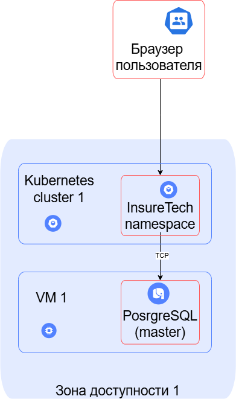
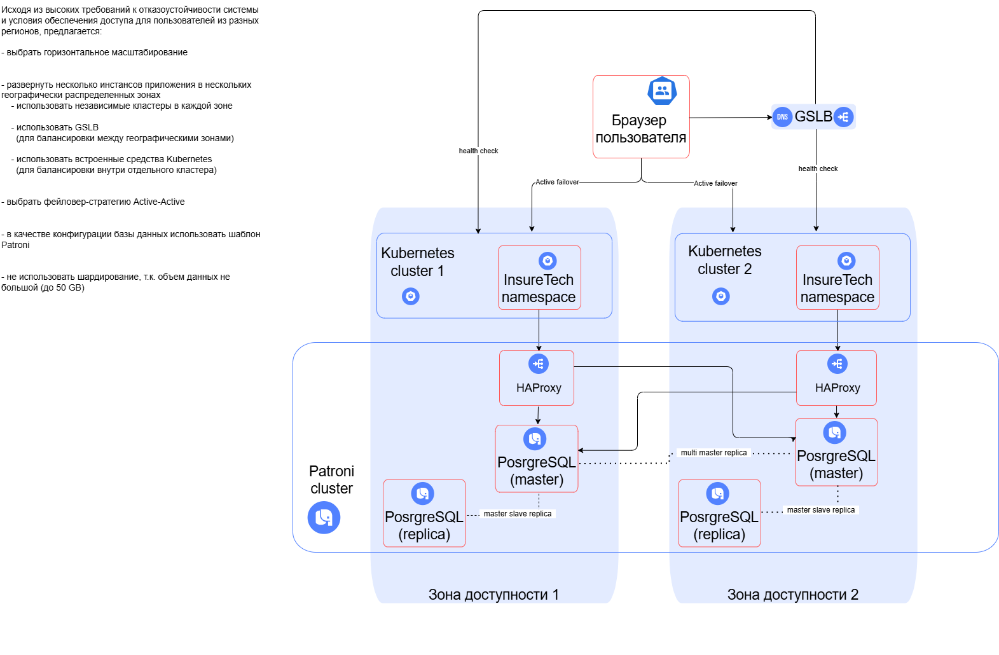

### Диаграмма AS-IS

---

Исходя из высоких требований к отказоустойчивости системы и условия обеспечения доступа для пользователей из разных регионов, предлагается:
- выбрать горизонтальное масштабирование

- развернуть несколько инстансов приложения в нескольких географически распределенных зонах
  - использовать независимые кластеры в каждой зоне
  - использовать GSLB (для балансировки между географическими зонами)
  - использовать встроенные средства Kubernetes (для балансировки внутри отдельного кластера)

- выбрать фейловер-стратегию Active-Active

- в качестве конфигурации базы данных использовать шаблон Patroni

- не использовать шардирование, т.к. объем данных не большой (до 50 GB)

### Диаграмма TO-BE
