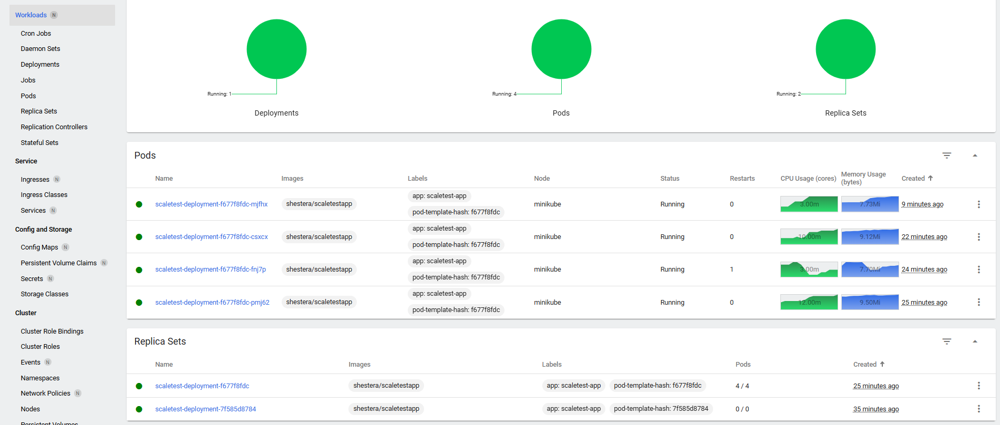
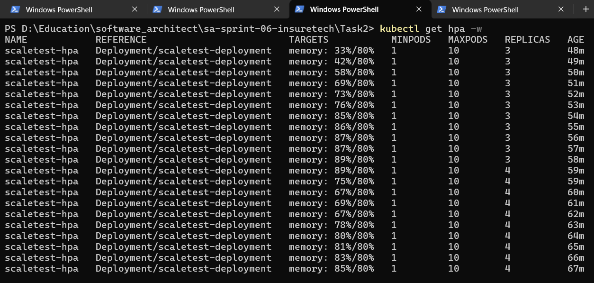
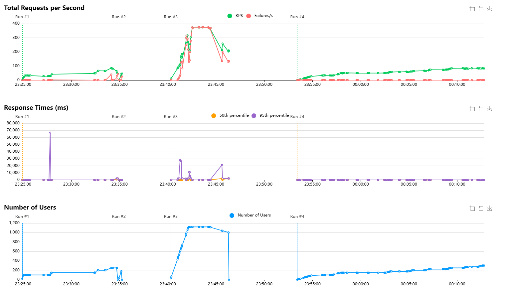
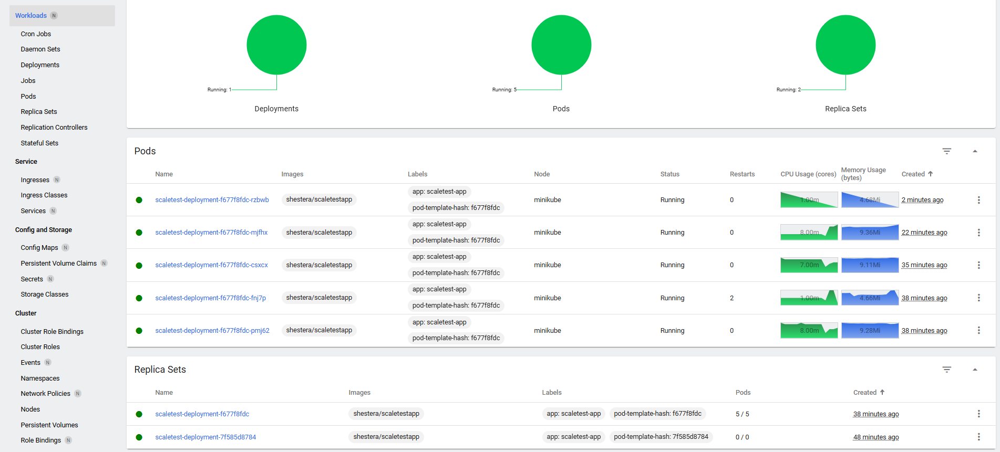
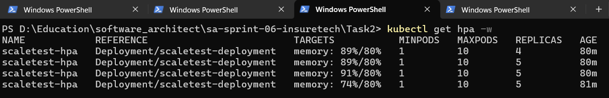
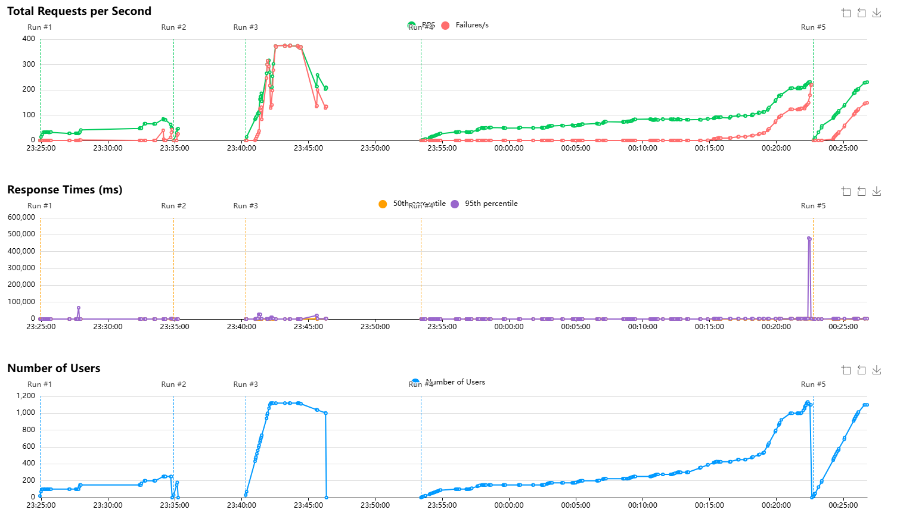

**Важно**

Манифест `deployment.yaml` писался исходя из задания, но на практике (для создания скринов), пришлось его немного подкорректировать т.к. не хватало ресурсов ноутбука.

Главное из скринов видно - что динамическая маршрутизация работает.

---
**Скрины и логи**

Увеличение с 3 до 4 реплик

Увеличение с 4 до 5 реплик

---
**Команды**

1. Поднимите локальный кластер Kubernetes в Minikube

    `minikube start`

2. Активируйте `metrics-server`
   - включить `metrics-server` при запуске `minikube`: `minikube start --addons=metrics-server`
   - активировать отдельно (если `minikube` уже запущен): `minikube addons enable metrics-server`
   - проверить статус `metrics-server`: `kubectl get deployment metrics-server -n <наименование namespace>`
     
3. Напишите манифест развёртывания, примените написанную конфигурацию: `kubectl apply -f deployment.yaml`

4. Напишите и примените манифест сервиса (Service) для доступа к приложению, которое вы установили на прошлом шаге:
   - применить: `kubectl apply -f service.yaml`
   - проверить: `kubectl get services`
   - открыть браузер с доступом к вашему приложению через сервис: `minikube service scaletest-service`
   - узнать адрес по которому можно получить доступ к указанному сервису Kubernetes: `minikube service scaletest-service --url`

5. Настройте динамическую маршрутизацию, примените манифест в вашем кластере:
   - применить: `kubectl apply -f hpa.yaml`
   - проверить: `kubectl get hpa -w`
