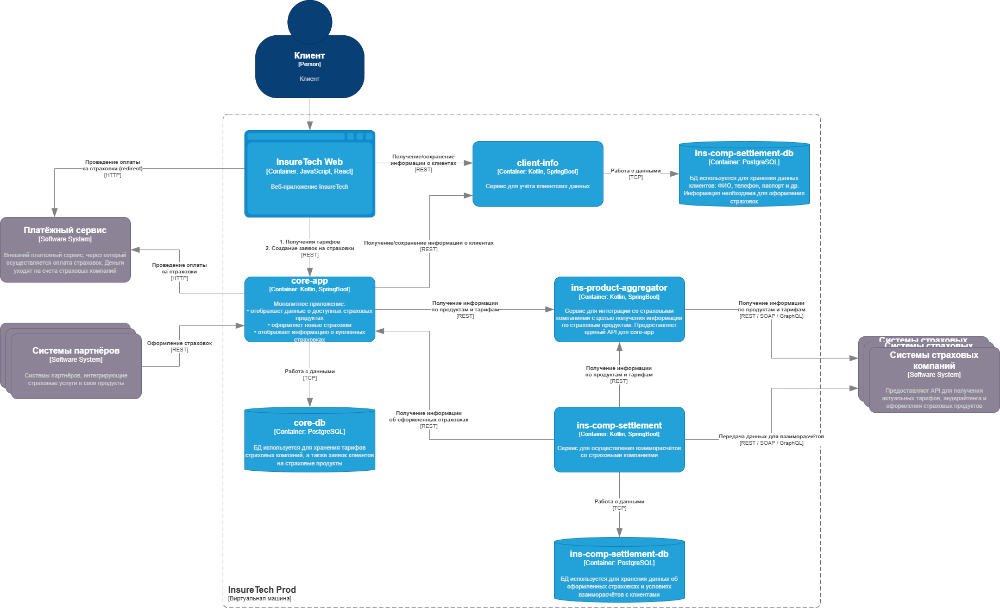
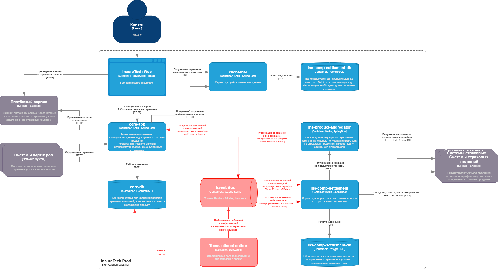

### Диаграмма AS-IS

---

## Проблемы и риски
**Существующие проблемы**
- команда уже сталкивается с ошибками взаимодействия между сервисами `ins-product-aggregator`, `ins-comp-settlement` 
- проблемы связаны с задержками ответов или ошибками при взаимодействии с API страховых компаний

Операции, которые могли бы выполняться асинхронно `Event-bus`:
- сервис `core-app` осуществляет запрос к `ins-product-aggregator` раз в 15 минут
- сервис `ins-comp-settlement` осуществляет запрос к `ins-product-aggregator` раз в сутки (ночью) при формировании реестра оформленных страховок
- сервис `ins-comp-settlement` раз в сутки осуществляет запрос в `core-app` по `REST API` для получения всех оформленных за день страховок

**Transactional Outbox**
- в целях избежания возможной несогласованности данных, можно использовать паттерн Transactional Outbox в сервисе `core-app`, т.к. он и пишет данные в `БД`, и отправляет сообщения в `Event-bus`

### Диаграмма TO-BE
